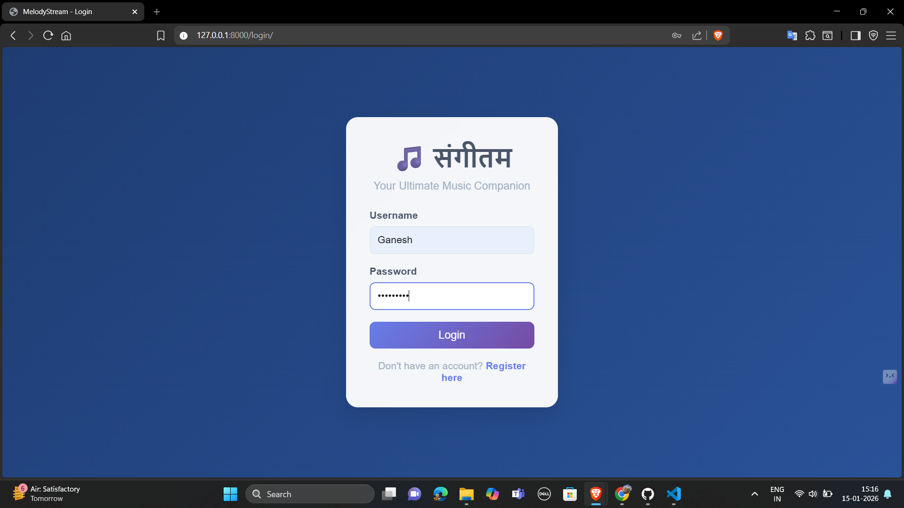
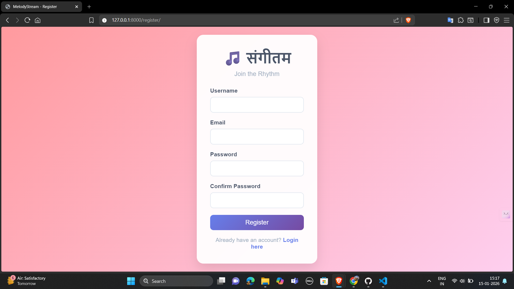
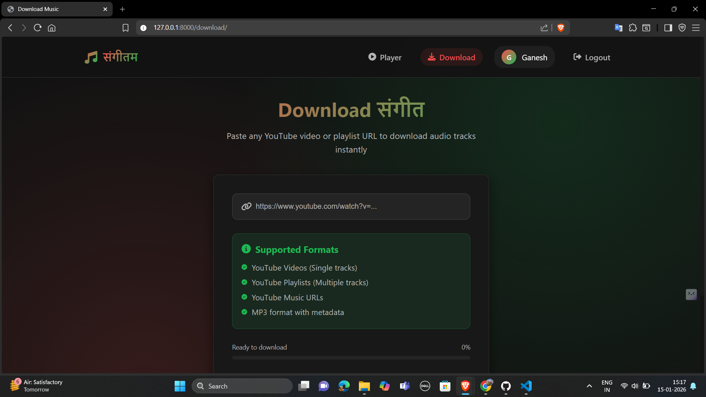
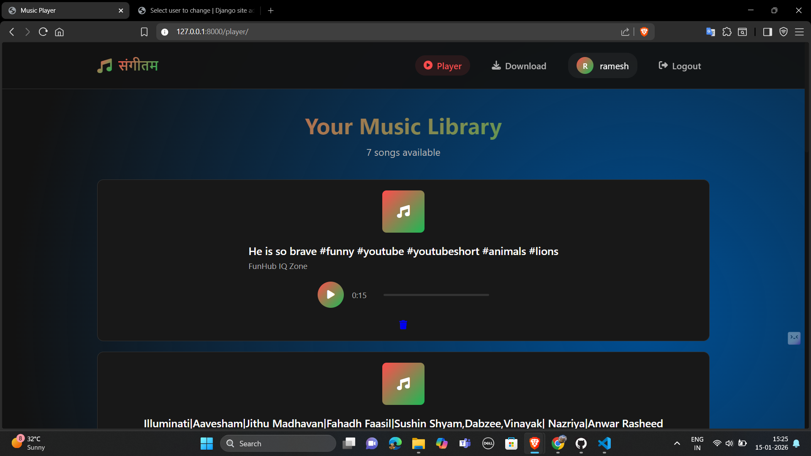
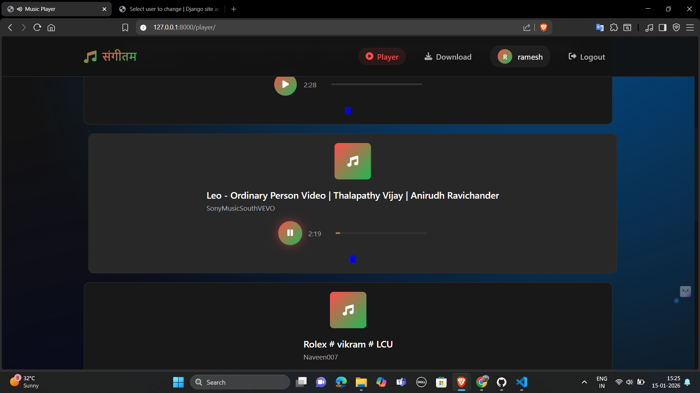
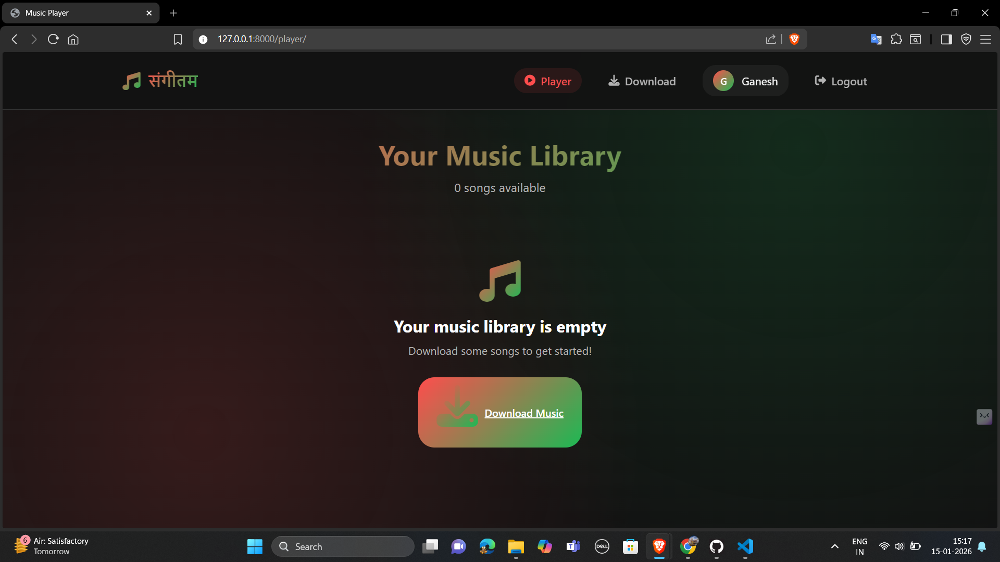

# 🎵 संगीतम (Sangeetam) – Django Music Player

**संगीतम** is a Django-based music player web application that allows users to download music from YouTube playlists or single videos and listen to them in a clean, user-friendly interface.  
Each user gets their own private music library with secure authentication.

---

## 🚀 Features

- 🔐 User Authentication (Register / Login / Logout)
- 🎧 Download songs from **YouTube playlists & single videos** using `yt-dlp`
- 📂 Automatic **user-wise music folders**
- 🗃️ Songs stored and managed in the database
- ▶️ Built-in music player (Play / Pause)
- 📊 Real-time **download progress bar**
- 🛡️ Secure user-specific access (no cross-user access)
- 🖥️ Django Admin panel support

---

## 🛠️ Tech Stack

- **Backend:** Django (Python)
- **Frontend:** HTML, CSS, JavaScript
- **Database:** SQLite (can be upgraded to MySQL/PostgreSQL)
- **Media Handling:** yt-dlp, FFmpeg
- **Authentication:** Django Built-in Auth System

---

## 📸 Screenshots

### 🔑 Login Page

### 📝 Register Page

### ⬇️ Download Music Page

### 🎶 Music Player

### ⚙️ Home Panel

